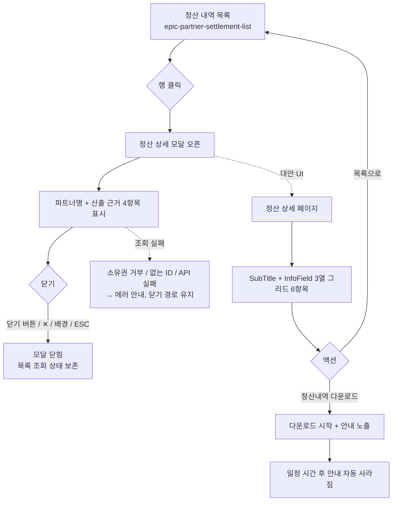

# 에픽: partner-settlement-detail (파트너 정산 상세 조회)

> 캔버스: one-canvas/sample/partner-settlement/canvas-partner-settlement-detail.html

## 목적 (비즈니스 목표)
파트너가 정산 금액이 왜 그 금액인지 스스로 납득할 수 있도록 산출 근거를 공개해, 금액 관련 문의를 줄인다.

## 주요 범위 (In-Scope)
목록에서 건별 상세 확인(모달), 정산 상세 페이지형 대안 UI, 정산 내역서 다운로드

## 제외 범위 (Out-of-Scope)
정산 금액 수정 및 이의 신청 접수(별도 에픽으로 이관)

## 완료 기준
파트너가 목록에서 특정 건을 클릭해 상세 산출 근거(판매액/수수료/조정 금액/최종 정산액)를 확인하고, 정산 내역서를 다운로드할 수 있어야 한다.

## 참조 자료

### 화면 목록
> 화면 구현 시 아래 앵커로 캔버스의 해당 화면을 바로 연다. 앵커는 위 `캔버스:` 파일 기준 — `<캔버스 파일>#<앵커>`
> 각 화면의 컴포넌트 태깅(`<!-- component: X -->`)과 번호별 디스크립션이 화면 구성의 단일 출처다.

| 화면 | 화면명 | 앵커 | 대응 스토리 |
|---|---|---|---|
| 화면 1 | settlement-detail-modal (정산 상세 모달) | `#screen-detail-modal` | story-settlement-detail |
| 화면 2 | settlement-detail-page (정산 상세 페이지형) | `#screen-detail-page` | story-settlement-detail (대안 UI) |

- 상세 모달 마크업은 캔버스 문서 하단의 **전역 모달**(`#detailModal`)이다. 화면 1은 진입점(행 클릭)만 축약해 보여주며, **목록 조회·필터·페이지네이션 정책은 이 에픽 범위가 아니다** — `epic-partner-settlement-list` 참조.

### 참고 자료
> one-canvas `참고 자료` 섹션 계승 (분리된 캔버스가 동일 자료를 반복 기재하므로 목록 에픽과 같다)

- **Figma 디자인 시안** — https://figma.com/file/xxxx-partner-settlement — 정산 내역 조회 화면 3종 hi-fi 시안
- **정산 수수료율 정책 엑셀** — https://docs.google.com/spreadsheets/d/xxxx-settlement-fee — 파트너 등급별 수수료율 및 정산 주기 정의

### 디자인 시스템
- 참조 디렉터리: `design-system/admin-partner/src/components/{카테고리}/{컴포넌트명}` (파트너 웹 화면)
- 사용 컴포넌트 — **참조용 요약**이며, 화면 구성의 단일 출처는 캔버스의 `<!-- component: X -->` 태깅이다. 어긋나면 태깅을 따른다.
  - `inputs/`: button
  - `display/`: infoField, subTitle, divider
  - `feedback/`: modal
- 재사용 원칙: `settlement/index.md` 도메인 정책 「디자인 시스템 재사용 원칙」 참조

## 에픽 정책

### 상세 데이터 일관성
- 모달(화면 1)과 페이지형(화면 2)은 **같은 정산 상세 데이터·같은 산출 로직**을 사용한다. 화면마다 다른 계산 결과를 보여주지 않는다.
- 페이지형은 모달을 대체하지 않고 **병행 제공**한다. 모달에 없는 액션(목록으로 / 정산내역 다운로드)을 추가로 제공한다.

> 정산 금액 산출 공식·금액 표기·정산 상태 3종: `settlement/index.md` 참조

## 흐름도

## 하위 스토리
- story-settlement-detail: 파트너가 특정 건의 정산 상세를 확인한다 (모달 + 페이지형 대안 UI + 정산내역 다운로드)
