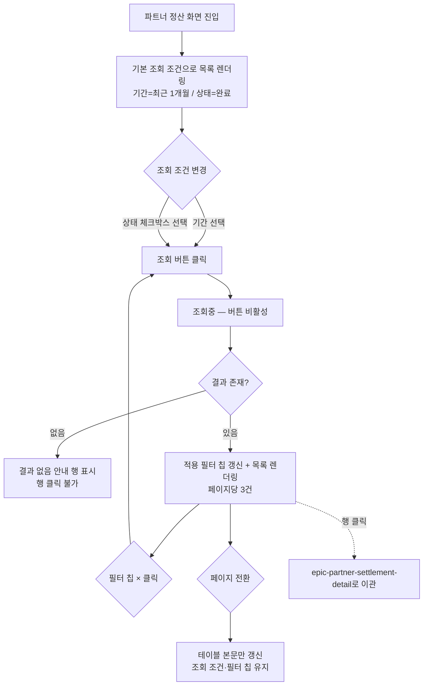

# 에픽: partner-settlement-list (파트너 정산 내역 조회)

> 캔버스: one-canvas/sample/partner-settlement/canvas-partner-settlement-list.html

## 목적 (비즈니스 목표)
파트너가 CS 문의 없이 자신의 정산 진행 상황을 스스로 파악할 수 있게 하여 CS 문의량을 줄인다.

## 주요 범위 (In-Scope)
정산 내역 목록 조회(기간·상태 필터), 적용된 필터 표시

## 제외 범위 (Out-of-Scope)
정산 현황 요약 대시보드(epic-partner-settlement-summary로 분리), 건별 상세 산출 근거 확인(epic-partner-settlement-detail로 분리), 정산 금액 수정 및 이의 신청 접수(epic-partner-settlement-detail 제외 범위 참조)

## 완료 기준
파트너가 기간·상태로 정산 내역을 조회하고, 적용된 조건을 확인하며 페이지를 넘겨 전체 결과를 볼 수 있어야 한다.

## 참조 자료

### 화면 목록
> 화면 구현 시 아래 앵커로 캔버스의 해당 화면을 바로 연다. 앵커는 위 `캔버스:` 파일 기준 — `<캔버스 파일>#<앵커>`
> 각 화면의 컴포넌트 태깅(`<!-- component: X -->`)과 번호별 디스크립션이 화면 구성의 단일 출처다.

| 화면 | 화면명 | 앵커 | 대응 스토리 |
|---|---|---|---|
| 화면 1 | settlement-list (정산 내역 조회) | `#screen-list` | story-settlement-search / story-settlement-filter |

- 화면 1의 **행 클릭 → 상세 모달**은 이 에픽 범위가 아니다. `epic-partner-settlement-detail` 참조.

### 참고 자료
> one-canvas `참고 자료` 섹션 계승

- **Figma 디자인 시안** — https://figma.com/file/xxxx-partner-settlement — 정산 내역 조회 화면 3종 hi-fi 시안
- **정산 수수료율 정책 엑셀** — https://docs.google.com/spreadsheets/d/xxxx-settlement-fee — 파트너 등급별 수수료율 및 정산 주기 정의

### 디자인 시스템
- 참조 디렉터리: `design-system/admin-partner/src/components/{카테고리}/{컴포넌트명}` (파트너 웹 화면)
- 사용 컴포넌트 — **참조용 요약**이며, 화면 구성의 단일 출처는 캔버스의 `<!-- component: X -->` 태깅이다. 어긋나면 태깅을 따른다.
  - `inputs/`: button, checkbox, dateRangePicker, filterChip
  - `display/`: table, tag, pagination
- 재사용 원칙: `settlement/index.md` 도메인 정책 「디자인 시스템 재사용 원칙」 참조

## 에픽 정책

### 디자인 시스템 미보유 항목 — 태스크 범위 밖
- 이 에픽에서 식별된 디자인 시스템 미보유 항목은 **없다.** 화면 1의 모든 요소는 기존 `design-system/admin-partner` 컴포넌트로 구성 가능함을 확인했다.
- 정산 추이 차트(TrendSparkline) 미보유 항목은 요약 대시보드 화면에 속하므로 `epic-partner-settlement-summary`가 소유한다.
- 디자인 시스템 자체를 손대는 작업은 어느 에픽에서도 태스크로 만들지 않는다(agile-issue-rule.md 「태스크 범위에서 제외되는 작업 — 디자인 시스템」).

> 정산 상태 3종·금액 표기·산출 공식 등 도메인 전반 규칙: `settlement/index.md` 참조

## 흐름도

## 하위 스토리
- story-settlement-search: 파트너가 기간별로 정산 내역을 검색한다 (조회·결과없음·페이지네이션)
- story-settlement-filter: 파트너가 정산 상태로 내역을 필터링한다 (상태 다중 선택·적용 필터 칩)
