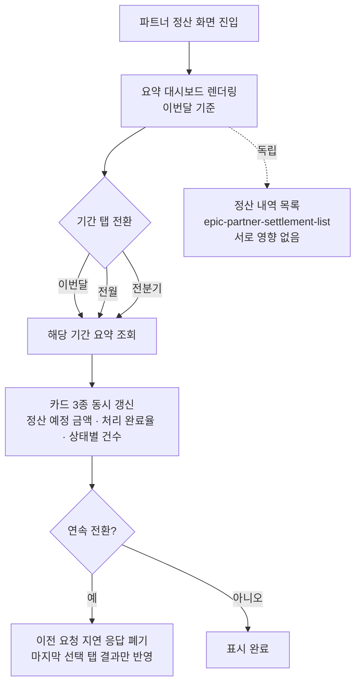

# 에픽: partner-settlement-summary (파트너 정산 요약 대시보드)

> 캔버스: one-canvas/sample/partner-settlement/canvas-partner-settlement-summary.html

## 목적 (비즈니스 목표)
파트너가 정산 내역을 일일이 훑지 않고도 기간별 정산 규모와 처리 현황을 한눈에 파악할 수 있게 한다.

## 주요 범위 (In-Scope)
기간 탭(이번달/전월/전분기) 전환, 정산 예정 금액·처리 완료율·상태별 건수 요약 카드

## 제외 범위 (Out-of-Scope)
정산 내역 목록 조회 및 기간·상태 필터(epic-partner-settlement-list로 분리), 건별 상세 산출 근거 확인(epic-partner-settlement-detail로 분리), 정산 추이 차트(TrendSparkline) 실제 구현(1단계에서는 디자인 시스템 미보유 사실만 기록하고, 공용 편입 여부·구현은 후속 확정)

## 완료 기준
파트너가 기간 탭을 전환해 해당 기간의 정산 예정 총액·처리 완료율·상태별 건수를 한눈에 확인할 수 있어야 한다.

## 참조 자료

### 화면 목록
> 화면 구현 시 아래 앵커로 캔버스의 해당 화면을 바로 연다. 앵커는 위 `캔버스:` 파일 기준 — `<캔버스 파일>#<앵커>`
> 각 화면의 컴포넌트 태깅(`<!-- component: X -->`)과 번호별 디스크립션이 화면 구성의 단일 출처다.

| 화면 | 화면명 | 앵커 | 대응 스토리 |
|---|---|---|---|
| 화면 1 | settlement-summary (정산 요약 대시보드) | `#screen-summary` | story-settlement-summary |

- 요약 대시보드는 정산 내역 목록과 **독립적으로** 동작한다 — 목록의 조회 조건(기간·상태 필터)에 영향을 주지도, 받지도 않는다.

### 참고 자료
> one-canvas `참고 자료` 섹션 계승 (분리된 캔버스가 동일 자료를 반복 기재하므로 다른 정산 에픽과 같다)

- **Figma 디자인 시안** — https://figma.com/file/xxxx-partner-settlement — 정산 내역 조회 화면 3종 hi-fi 시안
- **정산 수수료율 정책 엑셀** — https://docs.google.com/spreadsheets/d/xxxx-settlement-fee — 파트너 등급별 수수료율 및 정산 주기 정의

### 디자인 시스템
- 참조 디렉터리: `design-system/admin-partner/src/components/{카테고리}/{컴포넌트명}` (파트너 웹 화면)
- 사용 컴포넌트 — **참조용 요약**이며, 화면 구성의 단일 출처는 캔버스의 `<!-- component: X -->` 태깅이다. 어긋나면 태깅을 따른다.
  - `display/`: tag, progressBar
  - `layout/`: card
  - `navigation/`: segmentedTabs
- 재사용 원칙: `settlement/index.md` 도메인 정책 「디자인 시스템 재사용 원칙」 참조

## 에픽 정책

### 디자인 시스템 미보유 항목 — 태스크 범위 밖
- 이 에픽에서 식별된 디자인 시스템 미보유 항목은 **TrendSparkline**(화면 1 ⑤ 정산 추이) 1건이며, 분류는 `신규 필요`다.
- **디자인 시스템 자체를 손대는 작업은 애자일 이슈의 태스크로 만들지 않는다**(agile-issue-rule.md 「태스크 범위에서 제외되는 작업 — 디자인 시스템」). 이 항목은 디자인 시스템 트랙에서 별도로 처리하며, 여기서는 `제외 범위`에 적어 범위 밖임을 밝히는 것까지만 한다.
- 분류가 `신규 필요`(어디에도 없음)이므로 **⑤ 정산 추이 화면 영역 자체도 보류**한다. 만약 `참조 전용(page-local)`·`variant 값 추가 필요`·`공용화 필요`였다면 컴포넌트가 이미 존재하므로 화면 구현 AC·태스크·테스트는 그대로 두었을 것이다.
- 나머지 화면 요소(SegmentedTabs, Card, ProgressBar, Tag)는 기존 `design-system/admin-partner` 컴포넌트로 구성 가능함을 확인했다.

> 정산 상태 3종·금액 표기·산출 공식 등 도메인 전반 규칙: `settlement/index.md` 참조

## 흐름도

## 하위 스토리
- story-settlement-summary: 파트너가 이번 달 정산 현황을 요약해서 확인한다 (기간 탭·요약 카드 3종)
